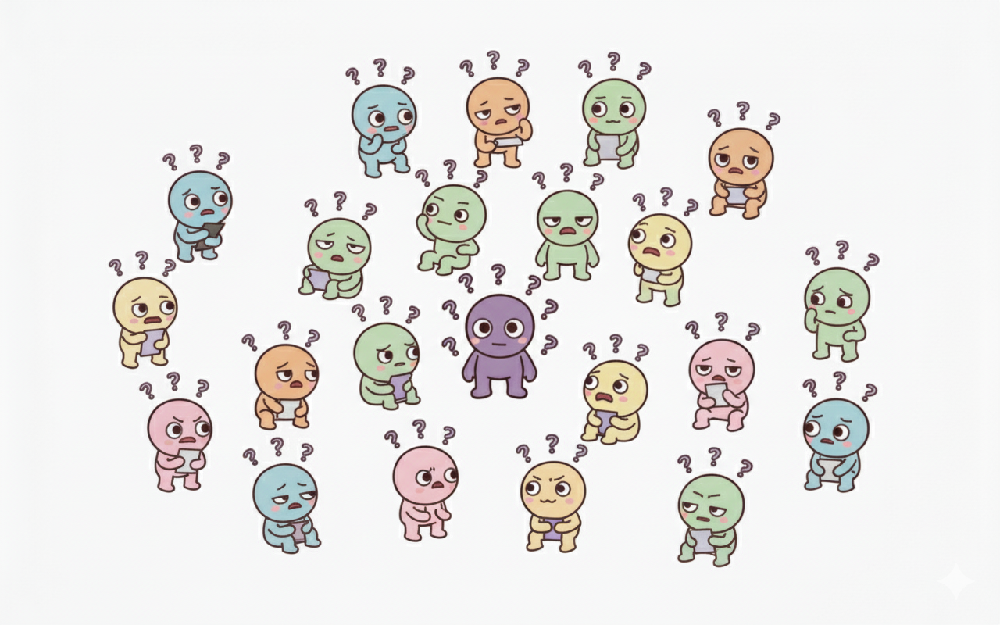
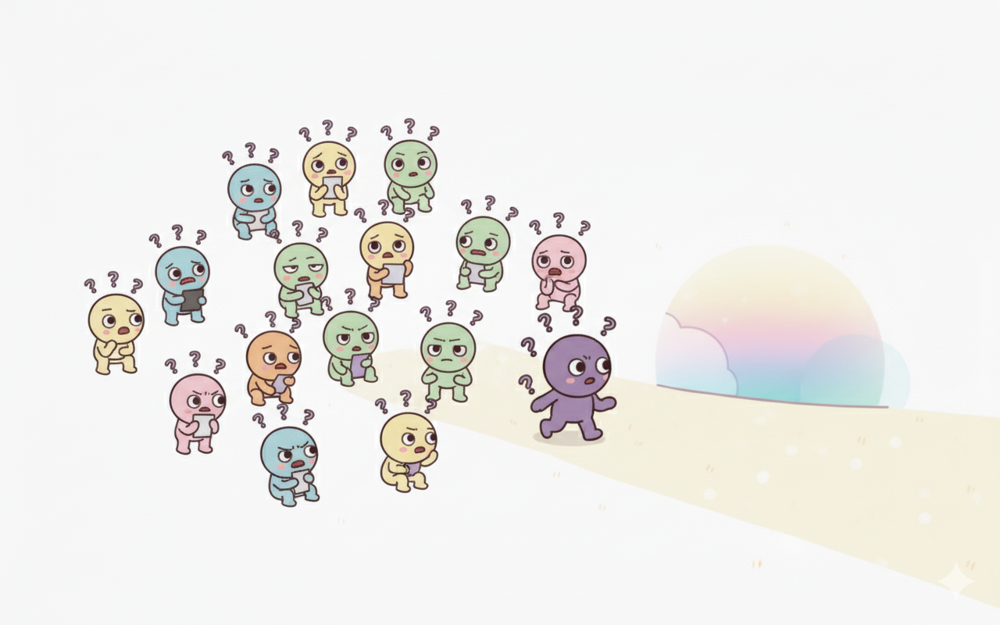

# Readme: Don't Worry!

## Parte 1: História e Motivação

### A Lenda de Worryland e os Worries

Dizem que para cada estudante sobrecarregado, uma pequena criatura nasce em uma terra distante, envolta pela densa névoa da procrastinação: **Worryland**. Este não é um lugar comum. Suas montanhas são pilhas de tarefas não iniciadas, seus rios são fluxos de pensamentos ansiosos e, ao longe, o som de prazos se aproximando ecoa como uma trovoada.

Os habitantes desta terra são os **Worries**. São criaturas nascidas da intenção e do potencial, mas paralisadas pela incerteza. Cada Worry carrega sobre a cabeça pontos de interrogação que brilham, simbolizando as perguntas que consomem sua energia: "Por onde eu começo?", "O que é mais importante?", "E se eu não conseguir?". Eles vagam sem rumo por Worryland, presos em um estado de "análise-parálise", querendo muito avançar, mas sem um caminho claro para seguir.

### A Jornada do Nosso Worry

No entanto, nossa história é sobre um Worry diferente. Um que, em meio ao caos e à confusão de seus pares, sentia que deveria haver uma saída daquela névoa paralisante. Ele estava cansado de se sentir acumulado, de ver seu potencial se afogar na indecisão. Ele não queria mais ser definido pela sua preocupação, mas sim por suas conquivas.

Com uma coragem que nem ele sabia que possuía, ele decidiu fazer o que nenhum outro Worry ousou: deixar Worryland para trás e procurar por um Guia.

Sua jornada foi solitária. Ele atravessou os campos da incerteza e escalou as colinas da autocrítica, sempre procurando por um farol, uma luz que pudesse lhe mostrar um caminho claro e um passo de cada vez.

Até que, finalmente, ele encontrou essa luz. Ele encontrou... **Você**.

### O Encontro e a Solução: Don't Worry!

O aplicativo **Don't Worry!** é a materialização desse encontro. Ele é o mapa que nosso Worry tanto procurava, a ferramenta criada para dissipar a névoa de Worryland para sempre. A nossa missão, impulsionada pelo desafio do hackathon, é ser o Guia que todo estudante merece.

Guiados pela filosofia de **"O aluno em primeiro lugar"** (*human-centered technology*), criamos uma plataforma que traduz o caos em clareza:

* **O Mapa para Sair da Névoa:** O app pega suas "montanhas de tarefas" e as transforma em uma trilha clara e gerenciável de atividades diárias. Ele mostra exatamente por onde começar.
* **A Energia para a Jornada:** Transformamos a jornada em um jogo. Ao completar tarefas, você não apenas avança nos estudos, mas também fortalece seu próprio Worry (avatar), personalizando-o e vendo-o evoluir de uma criatura preocupada para um ser confiante.
* **O Farol do Foco:** Nossas ferramentas de estatísticas e foco funcionam como um farol, mantendo sua atenção no presente e iluminando seu progresso, para que você nunca mais se sinta perdido na escuridão da sobrecarga.

Nossa motivação é criar uma aliança entre a tecnologia e o bem-estar do estudante. O **Don't Worry!** não é apenas um app; é uma promessa. A promessa de que, com o guia certo, é possível transformar a preocupação em ação e a ansiedade de Worryland em orgulho e realização.
