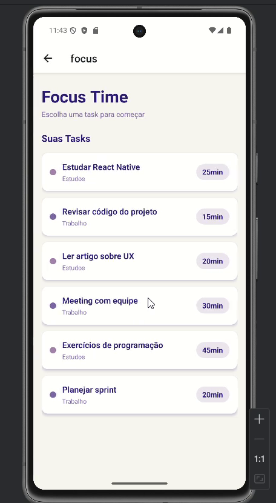
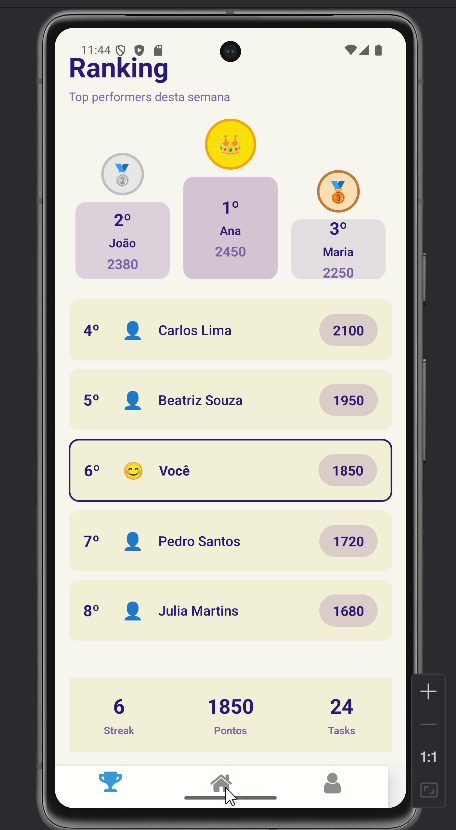

# Readme: Don't Worry!


## Parte 1: História e Motivação

### A Lenda de Worryland e os Worries

Dizem que para cada estudante sobrecarregado, uma pequena criatura nasce em uma terra distante, envolta pela densa névoa da procrastinação: **Worryland**. Este não é um lugar comum. Suas montanhas são pilhas de tarefas não iniciadas, seus rios são fluxos de pensamentos ansiosos e, ao longe, o som de prazos se aproximando ecoa como uma trovoada.

Os habitantes desta terra são os **Worries**. São criaturas nascidas da intenção e do potencial, mas paralisadas pela incerteza. Cada Worry carrega sobre a cabeça pontos de interrogação que brilham, simbolizando as perguntas que consomem sua energia: "Por onde eu começo?", "O que é mais importante?", "E se eu não conseguir?". Eles vagam sem rumo por Worryland, presos em um estado de "análise-parálise", querendo muito avançar, mas sem um caminho claro para seguir.


### A Jornada do Nosso Worry

No entanto, nossa história é sobre um Worry diferente. Um que, em meio ao caos e à confusão de seus pares, sentia que deveria haver uma saída daquela névoa paralisante. Ele estava cansado de se sentir acumulado, de ver seu potencial se afogar na indecisão. Ele não queria mais ser definido pela sua preocupação, mas sim por suas conquivas.

Com uma coragem que nem ele sabia que possuía, ele decidiu fazer o que nenhum outro Worry ousou: deixar Worryland para trás e procurar por um Guia.


Sua jornada foi solitária. Ele atravessou os campos da incerteza e escalou as colinas da autocrítica, sempre procurando por um farol, uma luz que pudesse lhe mostrar um caminho claro e um passo de cada vez.


Até que, finalmente, ele encontrou essa luz. Ele encontrou... **Você**.

### O Encontro e a Solução: Don't Worry!

O aplicativo **Don't Worry!** é a materialização desse encontro. Ele é o mapa que nosso Worry tanto procurava, a ferramenta criada para dissipar a névoa de Worryland para sempre. A nossa missão, impulsionada pelo desafio do hackathon, é ser o Guia que todo estudante merece.

Guiados pela filosofia de **"O aluno em primeiro lugar"** (*human-centered technology*), criamos uma plataforma que traduz o caos em clareza:

* **O Mapa para Sair da Névoa:** O app pega suas "montanhas de tarefas" e as transforma em uma trilha clara e gerenciável de atividades diárias. Ele mostra exatamente por onde começar.
* **A Energia para a Jornada:** Transformamos a jornada em um jogo. Ao completar tarefas, você não apenas avança nos estudos, mas também fortalece seu próprio Worry (avatar), personalizando-o e vendo-o evoluir de uma criatura preocupada para um ser confiante.
* **O Farol do Foco:** Nossas ferramentas de estatísticas e foco funcionam como um farol, mantendo sua atenção no presente e iluminando seu progresso, para que você nunca mais se sinta perdido na escuridão da sobrecarga.

Nossa motivação é criar uma aliança entre a tecnologia e o bem-estar do estudante. O **Don't Worry!** não é apenas um app; é uma promessa. A promessa de que, com o guia certo, é possível transformar a preocupação em ação e a ansiedade de Worryland em orgulho e realização.


## Parte 2: Telas e Funcionamento

Para resgatar os Worries de Worryland, desenvolvemos uma jornada clara e objetiva dentro do aplicativo. Cada tela foi projetada não apenas para ser funcional, mas para representar um passo concreto para fora da névoa da desorganização, transformando o usuário no verdadeiro Guia que seu Worry precisa.

### 1. Cadastro e Login: O Primeiro Passo para Fora de Worryland

A jornada começa no momento em que o usuário se conecta. Não se trata apenas de criar uma conta, mas de um ato simbólico: **adotar o seu primeiro Worry**.

* **Funcionalidade:** O usuário pode se cadastrar rapidamente usando seu e-mail ou contas do Google/Apple. O passo mais importante do cadastro é quando ele dá um nome ao seu Worry, criando um vínculo pessoal e imediato com seu novo companheiro de estudos.
* **Conexão com a História:** Este é o momento em que o usuário atende ao chamado do Worry perdido e assume oficialmente o papel de Guia. Dar um nome ao Worry o transforma de uma criatura abstrata em uma responsabilidade pessoal e um parceiro de jornada.
* 
#

#

#


### 2. Tutorial Interativo: Aprendendo o Caminho

Após o cadastro, o usuário não é jogado em uma interface vazia. Ele é acolhido com a própria história do Worry: a lenda de Worryland, a angústia dos Worries e a busca por um Guia.

* **Funcionalidade:** Um tutorial rápido e interativo (que será apresentado no vídeo do projeto) narra a história que fundamenta o app. Ele ensina o objetivo principal: completar tarefas para ajudar seu Worry a encontrar o caminho.
* **Conexão com a História:** Este onboarding estabelece o contexto emocional. O usuário entende que suas tarefas acadêmicas agora têm um propósito maior dentro do universo do app: cada tarefa concluída é um passo que seu Worry dá para longe da confusão.

### 3. Tela Home: Seu Mapa Diário

A tela principal é o centro de comando, o mapa que guia o usuário e seu Worry através das responsabilidades do dia.

* **Funcionalidade:** A Home exibe a lista de tarefas do dia de forma clara e organizada. Widgets mostram estatísticas importantes, como a porcentagem de tarefas completas, motivando o progresso. O avatar do Worry está sempre presente, reagindo visualmente ao desempenho do usuário.
* **Conexão com a História:** Esta tela é a materialização do "mapa para sair da névoa". Em vez da paisagem caótica de Worryland, o usuário encontra um caminho linear e alcançável. O Worry na tela não está mais perdido; ele olha para o usuário em busca da próxima instrução, pronto para avançar.


### 4. Timer de Foco: O Farol na Névoa

Ao selecionar uma tarefa, o usuário pode iniciar um timer de foco, baseado em técnicas como a de Pomodoro.

* **Funcionalidade:** Um timer de foco ajuda o usuário a se concentrar em uma única tarefa por um período determinado, sem distrações. A conclusão de um ciclo de foco é registrada como progresso na tarefa.
* **Conexão com a História:** O timer é o "farol" que mencionamos na história. Ele corta a névoa de distrações do mundo real, permitindo que o usuário e seu Worry deem um passo focado e significativo de cada vez. É a ferramenta que combate diretamente a "análise-parálise" de Worryland.


#


### 5. Meu Perfil e Gamificação: A Evolução do seu Worry

A tela de perfil é onde a jornada de crescimento se torna visível, tanto para o aluno quanto para seu companheiro.

* **Funcionalidade:** O perfil exibe estatísticas de longo prazo, como total de tarefas concluídas, dias seguidos de estudo (streaks) e conquistas. Os pontos ganhos ao completar tarefas podem ser usados para "comprar" itens e personalizar o avatar do Worry.
* **Conexão com a História:** Esta tela é a prova da evolução. O usuário pode ver, através de dados e da aparência de seu Worry, o quão longe eles chegaram. Um Worry customizado e feliz não é apenas um avatar enfeitado; ele é um símbolo de todas as "montanhas de tarefas" que foram superadas, representando a transformação da ansiedade em confiança e realização.


#


## Parte 3: Estrutura de Codificação

Para dar vida ao universo de Worryland e à jornada de organização do usuário, adotamos uma arquitetura moderna e desacoplada, composta por um frontend mobile e um backend de API. Essa abordagem nos permitiu desenvolver o MVP de forma ágil para o hackathon, garantindo ao mesmo tempo um caminho claro para a escalabilidade.

### Visão Geral da Arquitetura e Tech Stack

A solução é dividida em duas partes principais:

1.  **Frontend (App Mobile):** A interface com a qual o usuário interage, construída para ser intuitiva, reativa e imersiva. É o "Guia" tangível que ajuda o usuário em sua jornada.
2.  **Backend (API REST):** O cérebro do sistema, responsável por processar a lógica de negócio, gerenciar dados dos usuários, tarefas e a gamificação.

* **Tech Stack Principal:**
    * **Frontend:** React Native com Expo
    * **Backend:** Python com Flask
    * **Linguagens:** TypeScript (Frontend), Python (Backend)
    * **Roteamento (Frontend):** Expo Router
    * **Estilo (Frontend):** React Native StyleSheet

---

### Frontend (React Native com Expo)

Escolhemos **React Native com Expo** para o desenvolvimento do aplicativo pela sua agilidade e pela capacidade de criar uma experiência de usuário nativa para iOS e Android com uma única base de código.

#### Estrutura de Arquivos

Utilizamos o **Expo Router**, que adota uma convenção de roteamento baseada em arquivos, tornando a navegação e a organização do projeto extremamente intuitivas. A estrutura de arquivos é organizada por telas e funcionalidades:

* `/(tabs)`: Define a navegação principal do app após o login (Home, Foco, Perfil).
* `login.tsx` e `cadastro.tsx`: Telas do fluxo de autenticação.
* `worry_name.tsx`: Tela específica do onboarding para nomear o Worry, reforçando nossa narrativa.
* `focus.tsx`: Tela dedicada ao timer de foco, o core da funcionalidade de produtividade.

#### Exemplo de Componente: `login.tsx`

O código da tela de login demonstra nossa abordagem de componentização com React.

* **Estado e Navegação:** Usamos hooks como `useState` para gerenciar os dados do formulário e `useRouter` do Expo Router para controlar a navegação entre as telas.
* **Estilização:** O `StyleSheet` do React Native é utilizado para criar estilos otimizados e co-localizados com o componente, garantindo uma interface responsiva e de fácil manutenção.

```javascript
import React, { useState } from 'react';
import { View, Text, TextInput, TouchableOpacity, StyleSheet, Image, Dimensions, KeyboardAvoidingView, Platform, ScrollView } from 'react-native';
import { useRouter } from 'expo-router';

const { width, height } = Dimensions.get('window');

export default function LoginScreen() {
  const [usuario, setUsuario] = useState('');
  const router = useRouter();

  function handleLogin() {
    if (usuario.trim()) {
      router.replace('/(tabs)');
    }
  }

  function handleGoToCadastro() {
    router.push('/cadastro');
  }

  return (
    <KeyboardAvoidingView 
      style={styles.container}
      behavior={Platform.OS === 'ios' ? 'padding' : 'height'}
    >
      <ScrollView 
        contentContainerStyle={styles.scrollContent}
        showsVerticalScrollIndicator={false}
        keyboardShouldPersistTaps="handled"
      >
        <View style={styles.header}>
          <Image 
            source={require('../assets/images/dont_worry.png')} 
            style={styles.dontWorryImg} 
            resizeMode="contain" 
          />
          <Image 
            source={require('../assets/images/app_centrado_aluno.png')} 
            style={styles.centradoImg} 
            resizeMode="contain" 
          />
          <Image 
            source={require('../assets/images/worry_login.png')} 
            style={styles.worryImg} 
            resizeMode="contain" 
          />
        </View>
        
        <View style={styles.form}>
          <Text style={styles.label}>Insira seu e-mail:</Text>
          <TextInput
            style={styles.input}
            placeholder="email@dominio.com"
            value={usuario}
            onChangeText={setUsuario}
            autoCapitalize="none"
            keyboardType="email-address"
          />
          <TouchableOpacity style={styles.buttonBlack} onPress={handleLogin}>
            <Text style={styles.buttonBlackText}>Continuar</Text>
          </TouchableOpacity>
          
          <Text style={styles.orText}>or</Text>
          
          <TouchableOpacity style={styles.buttonGray}>
            <Text style={styles.buttonGrayText}>Continuar com Google</Text>
          </TouchableOpacity>
          <TouchableOpacity style={styles.buttonGray}>
            <Text style={styles.buttonGrayText}>Continuar com Apple</Text>
          </TouchableOpacity>
          <TouchableOpacity style={styles.buttonPurple} onPress={handleGoToCadastro}>
            <Text style={styles.buttonPurpleText}>Criar uma conta</Text>
          </TouchableOpacity>
        </View>
      </ScrollView>
    </KeyboardAvoidingView>
  );
}

const styles = StyleSheet.create({
  container: {
    flex: 1,
    backgroundColor: '#fff',
  },
  scrollContent: {
    flexGrow: 1,
    paddingHorizontal: width * 0.06,
    paddingTop: height * 0.06,
    paddingBottom: 24,
  },
  header: {
    marginBottom: height * 0.02,
    minHeight: height * 0.25,
    position: 'relative',
  },
  dontWorryImg: {
    width: width * 0.46,
    height: height * 0.11,
    marginTop: height * 0.01,
    marginLeft: width * 0.07,
    marginBottom: 0,
  },
  centradoImg: {
    marginLeft: width * 0.07,
    marginTop: height * 0.05,
    width: width * 0.71,
    height: height * 0.04,
    marginBottom: 12,
  },
  worryImg: {
    width: width * 0.625,
    height: height * 0.25,
    position: 'absolute',
    right: -width * 0.35,
    top: -height * 0.02,
    transform: [{ rotate: '320deg' }],
  },
  form: {
    marginTop: height * 0.05,
    alignItems: 'center',
    width: '100%',
  },
  label: {
    fontSize: width * 0.04,
    color: '#444',
    alignSelf: 'flex-start',
    marginBottom: 6,
    marginLeft: width * 0.02,
  },
  input: {
    width: '100%',
    maxWidth: 400,
    height: height * 0.055,
    borderColor: '#ccc',
    borderWidth: 1,
    borderRadius: 8,
    paddingHorizontal: 12,
    marginBottom: 16,
    fontSize: width * 0.04,
    backgroundColor: '#fff',
    color: '#444',
  },
  buttonBlack: {
    width: '100%',
    maxWidth: 400,
    height: height * 0.055,
    backgroundColor: '#000',
    borderRadius: 8,
    justifyContent: 'center',
    alignItems: 'center',
    marginBottom: 12,
  },
  buttonBlackText: {
    color: '#fff',
    fontSize: width * 0.045,
    fontWeight: 'bold',
  },
  orText: {
    marginVertical: 8,
    color: '#888',
    fontSize: width * 0.04,
  },
  buttonGray: {
    width: '100%',
    maxWidth: 400,
    height: height * 0.055,
    backgroundColor: '#E0E0E0',
    borderRadius: 8,
    justifyContent: 'center',
    alignItems: 'center',
    marginBottom: 8,
    marginTop: 8,
  },
  buttonGrayText: {
    color: '#444',
    fontSize: width * 0.04,
    fontWeight: 'bold',
  },
  buttonPurple: {
    width: '100%',
    maxWidth: 400,
    height: height * 0.055,
    backgroundColor: '#A685AB',
    borderRadius: 8,
    justifyContent: 'center',
    alignItems: 'center',
    marginTop: height * 0.04,
  },
  buttonPurpleText: {
    color: '#fff',
    fontSize: width * 0.04,
    fontWeight: 'bold',
  },
});
```

### Backend (Python com Flask)

Para o backend, optamos por **Python com Flask** por sua simplicidade, leveza e poder para criar APIs RESTful rapidamente, o que é ideal para o ritmo de um hackathon.

#### Funcionalidades da API

O servidor Flask centraliza a lógica de negócio e os dados da aplicação. Ele foi projetado para ser o "cérebro" que orquestra a jornada do usuário.

* **Autenticação (`/auth/login`):** Gerencia o acesso dos usuários.
* **Sincronização (`/api/sync`):** Endpoint crucial que recebe os dados de progresso (tarefas concluídas, tempo focado) do frontend.
* **Gerenciamento de Dados (`/api/users`):** Rotas para consultar dados de usuários.
* **Gamificação (`/api/leaderboard`):** Calcula e serve um ranking dos usuários com base nos seus pontos, incentivando o engajamento.

#### Exemplo de Código do Backend: `app.py`

Este código completo exemplifica como o backend recebe dados do app e os processa. Para este MVP, utilizamos um armazenamento em memória (dicionários Python), que pode ser facilmente substituído por um banco de dados em uma versão de produção.

```python
#!/usr/bin/env python3
"""
Backend Flask para acessar dados do frontend React Native
Secomp Aura App
"""

from flask import Flask, request, jsonify
from flask_cors import CORS
import os
from datetime import datetime
import json

app = Flask(__name__)

# Configuração CORS para permitir acesso do frontend
CORS(app, origins=[
    "http://localhost:8081",  # Frontend desenvolvimento
    "[http://127.0.0.1:8081](http://127.0.0.1:8081)",
    "[https://seu-app.netlify.app](https://seu-app.netlify.app)"  # Frontend produção
], methods=['GET', 'POST', 'PUT', 'DELETE', 'OPTIONS'])

# Configurações
FRONTEND_URL = os.getenv('FRONTEND_URL', 'http://localhost:8081')
app.config['SECRET_KEY'] = 'secomp-secret-key'

# Armazenamento simples em memória (use banco de dados em produção)
users_data = {}
sync_history = []

# ============ ROTAS PARA SINCRONIZAÇÃO ============

@app.route('/api/sync', methods=['POST'])
def sync_frontend_data():
    """Recebe dados sincronizados do frontend"""
    try:
        data = request.get_json()
        
        if not data:
            return jsonify({'error': 'Nenhum dado recebido'}), 400
        
        user_id = data.get('userId', 'unknown')
        timestamp = datetime.now().isoformat()
        
        # Salvar dados do usuário
        users_data[user_id] = {
            'user_data': data.get('userData'),
            'usage_data': data.get('usageData'),
            'task_data': data.get('taskData'),
            'last_sync': timestamp
        }
        
        # Adicionar ao histórico
        sync_history.append({
            'user_id': user_id,
            'timestamp': timestamp,
            'data_size': len(str(data)),
            'status': 'success'
        })
        
        print(f"✅ Dados sincronizados para usuário {user_id}")
        
        return jsonify({
            'status': 'success',
            'message': 'Dados sincronizados com sucesso',
            'user_id': user_id,
            'timestamp': timestamp
        })
        
    except Exception as e:
        error_msg = str(e)
        print(f"❌ Erro na sincronização: {error_msg}")
        
        return jsonify({
            'status': 'error',
            'message': error_msg,
            'timestamp': datetime.now().isoformat()
        }), 500

# ============ ROTAS PARA USUÁRIOS ============

@app.route('/api/users', methods=['GET'])
def get_all_users():
    """Lista todos os usuários"""
    return jsonify({
        'status': 'success',
        'users': users_data,
        'count': len(users_data)
    })

@app.route('/api/users/<user_id>', methods=['GET'])
def get_user(user_id):
    """Busca dados de um usuário específico"""
    if user_id in users_data:
        return jsonify({
            'status': 'success',
            'user': users_data[user_id]
        })
    
    return jsonify({
        'status': 'error',
        'message': 'Usuário não encontrado'
    }), 404

# ============ ROTAS DE AUTENTICAÇÃO ============

@app.route('/auth/login', methods=['POST'])
def login():
    """Autenticação simples"""
    data = request.get_json()
    email = data.get('email', '')
    
    if email:
        user_id = email.split('@')[0]
        
        return jsonify({
            'status': 'success',
            'message': 'Login realizado com sucesso',
            'user_id': user_id,
            'token': f'token-{user_id}',
            'timestamp': datetime.now().isoformat()
        })
    
    return jsonify({
        'status': 'error',
        'message': 'Email é obrigatório'
    }), 400

# ============ OUTRAS ROTAS ============

@app.route('/api/leaderboard', methods=['GET'])
def get_leaderboard():
    """Leaderboard dos usuários"""
    leaderboard = []
    
    for user_id, user_data in users_data.items():
        if user_data.get('user_data'):
            leaderboard.append({
                'user_id': user_id,
                'name': user_data['user_data'].get('name', user_id),
                'points': user_data['user_data'].get('points', 0),
                'tasks_completed': user_data['user_data'].get('tasks_completed', 0)
            })
    
    leaderboard.sort(key=lambda x: x['points'], reverse=True)
    
    for i, entry in enumerate(leaderboard):
        entry['position'] = i + 1
    
    return jsonify({
        'status': 'success',
        'leaderboard': leaderboard[:10],
        'total_users': len(leaderboard)
    })

if __name__ == '__main__':
    app.run(
        debug=True,
        host='0.0.0.0',
        port=5000,
        threaded=True
    )
```
## Parte 4: Deploy e Acesso ao Servidor na Magalu Cloud

Para o hackathon, utilizamos um **Servidor Virtual (VM) da Magalu Cloud** como peça central da nossa infraestrutura. Ele cumpriu um duplo propósito: hospedar a versão web pública do nosso MVP (deploy de produção) e servir como um ambiente de desenvolvimento e testes para a equipe.

Abaixo estão os dois guias: o primeiro para o deploy da versão final com Nginx, e o segundo para o acesso de desenvolvedores via SSH para rodar o ambiente de desenvolvimento.

---

### A. Deploy da Versão Web de Produção com Nginx

Este processo descreve como publicamos a versão estática e otimizada do nosso aplicativo na web.

#### 1. Produto Utilizado: Servidor Virtual
Utilizamos uma VM Linux da Magalu Cloud, que nos ofereceu total controle sobre o ambiente para instalar um servidor web Nginx e hospedar nossa aplicação.

#### 2. Processo de Deploy (Passo a Passo)

1.  **Preparação do Ambiente:** Acessamos o servidor e transferimos os arquivos do projeto para o diretório `/var/www/secomp/`.

2.  **Instalação do Web Server (Nginx):** Instalamos o Nginx, um servidor web de alta performance, para servir os arquivos estáticos da nossa aplicação.
    ```bash
    sudo apt update && sudo apt install nginx
    ```

3.  **Build da Aplicação Frontend:** Executamos o comando de build do Expo para gerar a pasta `web-build/` com os arquivos HTML, CSS e JavaScript otimizados.
    ```bash
    npm run build-web
    ```

4.  **Configuração do Nginx:** Criamos um arquivo de configuração em `/etc/nginx/sites-available/secomp` para apontar para nossa pasta de build e servir o `index.html`.
    ```nginx
    server {
        listen 80;
        server_name seu_dominio_ou_ip;
        root /var/www/secomp/web-build;
        index index.html;

        location / {
            try_files $uri $uri/ /index.html;
        }
    }
    ```

5.  **Ativação do Site:** Ativamos a nova configuração e reiniciamos o Nginx para colocar o site no ar.
    ```bash
    sudo ln -s /etc/nginx/sites-available/secomp /etc/nginx/sites-enabled/
    sudo systemctl restart nginx
    ```

#### 3. Resultado Final 🎉
Com esses passos, o MVP do "Don't Worry!" tornou-se publicamente acessível através do IP do nosso **Servidor Virtual da Magalu Cloud**, rodando de forma estável na porta 80.

---

### B. Guia de Acesso ao Ambiente de Desenvolvimento (via SSH)

Este guia é para desenvolvedores se conectarem ao servidor para instalar dependências e rodar o ambiente de desenvolvimento do Expo em tempo real.

#### 1. Pré-requisitos

* Um terminal com cliente SSH.
* Sua **chave SSH privada** correspondente à chave pública (`ssh-ed25519...`) configurada no servidor.

#### 2. Conectando ao Servidor

Use o comando SSH com seu usuário e o IP do servidor. Tente `borgescaua` ou `ubuntu` como nome de usuário.
```bash
# Conecte-se usando o IP fornecido
ssh borgescaua@201.23.72.235
```
#### 3. Executando o Projeto

Após conectar:

1.  **Navegue até o diretório do projeto:**
    ```bash
    cd /var/www/secomp
    ```

2.  **Instale as dependências:**
    ```bash
    npm install
    ```

3.  **Inicie o servidor de desenvolvimento do Expo:**
    ```bash
    npx expo start
    ```

#### 4. Dicas Importantes

* **Manter o Servidor Rodando:** Para que o `npx expo start` não morra ao fechar o terminal, use uma ferramenta como o `pm2`:
    ```bash
    # Instalar PM2 (uma vez)
    npm install -g pm2
    
    # Iniciar o app com PM2
    pm2 start "npx expo start" --name "dont-worry-dev"
    ```

* **Acesso via Navegador:** O servidor de desenvolvimento do Expo rodará em uma porta específica (ex: `8081`). Acesse-o em: `http://201.23.72.235:8081`. Lembre-se de liberar essa porta no firewall da Magalu Cloud, se necessário.

* **Problemas de Permissão com a Chave?** Se receber um erro de permissões "too open" no seu computador local, execute:
    ```bash
    # No seu computador (Linux/macOS)
    chmod 600 ~/.ssh/id_ed25519
    ```

