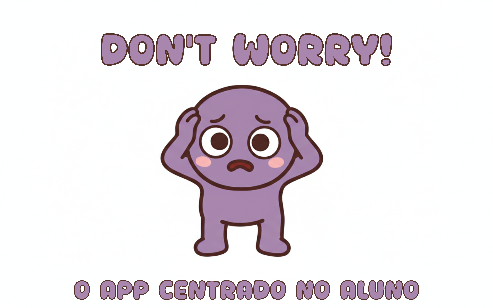
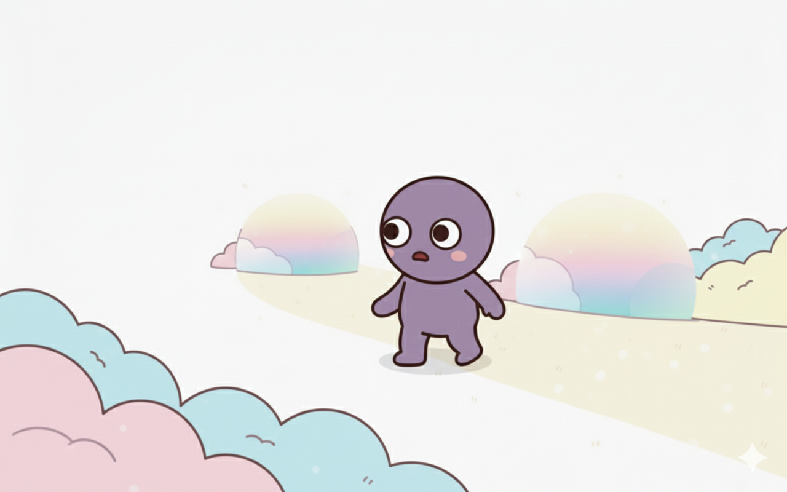
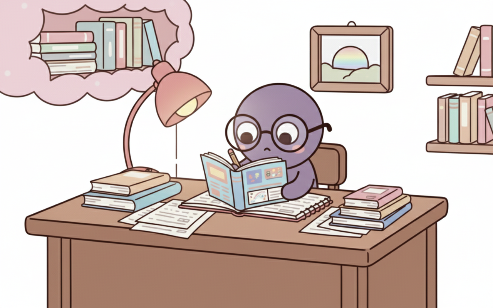
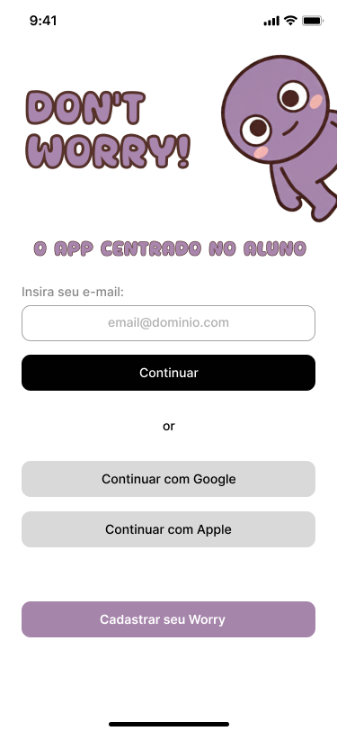
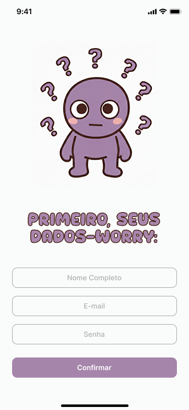
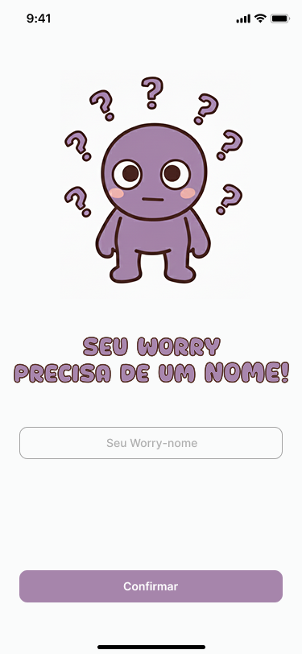
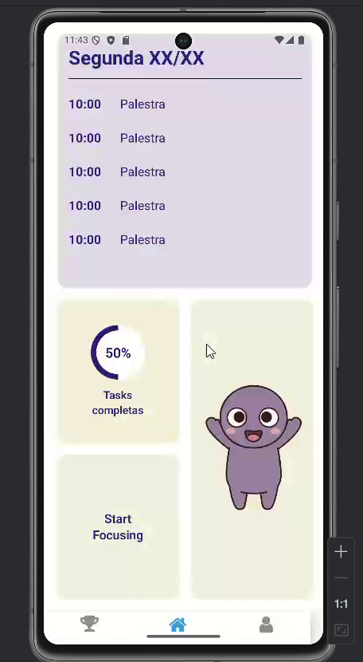
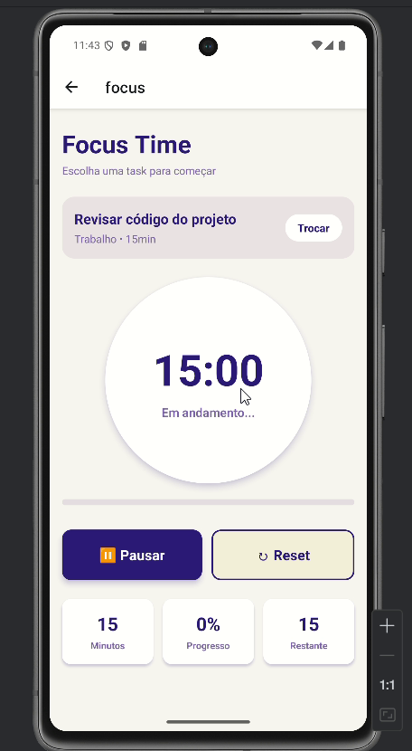
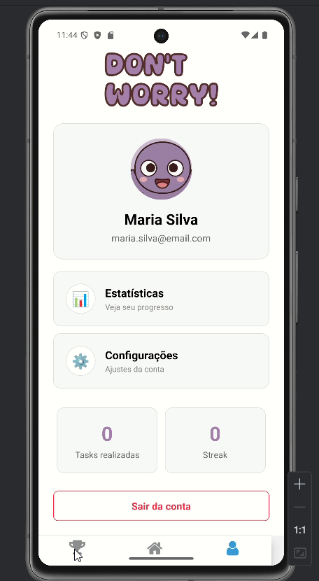

# Readme: Don't Worry!

## Parte 1: História e Motivação

### A Lenda de Worryland e os Worries

Dizem que para cada estudante sobrecarregado, uma pequena criatura nasce em uma terra distante, envolta pela densa névoa da procrastinação: **Worryland**. Este não é um lugar comum. Suas montanhas são pilhas de tarefas não iniciadas, seus rios são fluxos de pensamentos ansiosos e, ao longe, o som de prazos se aproximando ecoa como uma trovoada.

Os habitantes desta terra são os **Worries**. São criaturas nascidas da intenção e do potencial, mas paralisadas pela incerteza. Cada Worry carrega sobre a cabeça pontos de interrogação que brilham, simbolizando as perguntas que consomem sua energia: "Por onde eu começo?", "O que é mais importante?", "E se eu não conseguir?". Eles vagam sem rumo por Worryland, presos em um estado de "análise-parálise", querendo muito avançar, mas sem um caminho claro para seguir.

### A Jornada do Nosso Worry

No entanto, nossa história é sobre um Worry diferente. Um que, em meio ao caos e à confusão de seus pares, sentia que deveria haver uma saída daquela névoa paralisante. Ele estava cansado de se sentir acumulado, de ver seu potencial se afogar na indecisão. Ele não queria mais ser definido pela sua preocupação, mas sim por suas conquivas.

Com uma coragem que nem ele sabia que possuía, ele decidiu fazer o que nenhum outro Worry ousou: deixar Worryland para trás e procurar por um Guia.

Sua jornada foi solitária. Ele atravessou os campos da incerteza e escalou as colinas da autocrítica, sempre procurando por um farol, uma luz que pudesse lhe mostrar um caminho claro e um passo de cada vez.

Até que, finalmente, ele encontrou essa luz. Ele encontrou... **Você**.

### O Encontro e a Solução: Don't Worry!

O aplicativo **Don't Worry!** é a materialização desse encontro. Ele é o mapa que nosso Worry tanto procurava, a ferramenta criada para dissipar a névoa de Worryland para sempre. A nossa missão, impulsionada pelo desafio do hackathon, é ser o Guia que todo estudante merece.

Guiados pela filosofia de **"O aluno em primeiro lugar"** (*human-centered technology*), criamos uma plataforma que traduz o caos em clareza:

* **O Mapa para Sair da Névoa:** O app pega suas "montanhas de tarefas" e as transforma em uma trilha clara e gerenciável de atividades diárias. Ele mostra exatamente por onde começar.
* **A Energia para a Jornada:** Transformamos a jornada em um jogo. Ao completar tarefas, você não apenas avança nos estudos, mas também fortalece seu próprio Worry (avatar), personalizando-o e vendo-o evoluir de uma criatura preocupada para um ser confiante.
* **O Farol do Foco:** Nossas ferramentas de estatísticas e foco funcionam como um farol, mantendo sua atenção no presente e iluminando seu progresso, para que você nunca mais se sinta perdido na escuridão da sobrecarga.

Nossa motivação é criar uma aliança entre a tecnologia e o bem-estar do estudante. O **Don't Worry!** não é apenas um app; é uma promessa. A promessa de que, com o guia certo, é possível transformar a preocupação em ação e a ansiedade de Worryland em orgulho e realização.

## Parte 2: Telas e Funcionamento

Para resgatar os Worries de Worryland, desenvolvemos uma jornada clara e objetiva dentro do aplicativo. Cada tela foi projetada não apenas para ser funcional, mas para representar um passo concreto para fora da névoa da desorganização, transformando o usuário no verdadeiro Guia que seu Worry precisa.

### 1. Cadastro e Login: O Primeiro Passo para Fora de Worryland

A jornada começa no momento em que o usuário se conecta. Não se trata apenas de criar uma conta, mas de um ato simbólico: **adotar o seu primeiro Worry**.

* **Funcionalidade:** O usuário pode se cadastrar rapidamente usando seu e-mail ou contas do Google/Apple. O passo mais importante do cadastro é quando ele dá um nome ao seu Worry, criando um vínculo pessoal e imediato com seu novo companheiro de estudos.
* **Conexão com a História:** Este é o momento em que o usuário atende ao chamado do Worry perdido e assume oficialmente o papel de Guia. Dar um nome ao Worry o transforma de uma criatura abstrata em uma responsabilidade pessoal e um parceiro de jornada.

*

*

### 2. Tutorial Interativo: Aprendendo o Caminho

Após o cadastro, o usuário não é jogado em uma interface vazia. Ele é acolhido com a própria história do Worry: a lenda de Worryland, a angústia dos Worries e a busca por um Guia.

* **Funcionalidade:** Um tutorial rápido e interativo (que será apresentado no vídeo do projeto) narra a história que fundamenta o app. Ele ensina o objetivo principal: completar tarefas para ajudar seu Worry a encontrar o caminho.
* **Conexão com a História:** Este onboarding estabelece o contexto emocional. O usuário entende que suas tarefas acadêmicas agora têm um propósito maior dentro do universo do app: cada tarefa concluída é um passo que seu Worry dá para longe da confusão.

### 3. Tela Home: Seu Mapa Diário

A tela principal é o centro de comando, o mapa que guia o usuário e seu Worry através das responsabilidades do dia.

* **Funcionalidade:** A Home exibe a lista de tarefas do dia de forma clara e organizada. Widgets mostram estatísticas importantes, como a porcentagem de tarefas completas, motivando o progresso. O avatar do Worry está sempre presente, reagindo visualmente ao desempenho do usuário.
* **Conexão com a História:** Esta tela é a materialização do "mapa para sair da névoa". Em vez da paisagem caótica de Worryland, o usuário encontra um caminho linear e alcançável. O Worry na tela não está mais perdido; ele olha para o usuário em busca da próxima instrução, pronto para avançar.

### 4. Timer de Foco: O Farol na Névoa

Ao selecionar uma tarefa, o usuário pode iniciar um timer de foco, baseado em técnicas como a de Pomodoro.

* **Funcionalidade:** Um timer de foco ajuda o usuário a se concentrar em uma única tarefa por um período determinado, sem distrações. A conclusão de um ciclo de foco é registrada como progresso na tarefa.
* **Conexão com a História:** O timer é o "farol" que mencionamos na história. Ele corta a névoa de distrações do mundo real, permitindo que o usuário e seu Worry deem um passo focado e significativo de cada vez. É a ferramenta que combate diretamente a "análise-parálise" de Worryland.

### 5. Meu Perfil e Gamificação: A Evolução do seu Worry

A tela de perfil é onde a jornada de crescimento se torna visível, tanto para o aluno quanto para seu companheiro.

* **Funcionalidade:** O perfil exibe estatísticas de longo prazo, como total de tarefas concluídas, dias seguidos de estudo (streaks) e conquistas. Os pontos ganhos ao completar tarefas podem ser usados para "comprar" itens e personalizar o avatar do Worry.
* **Conexão com a História:** Esta tela é a prova da evolução. O usuário pode ver, através de dados e da aparência de seu Worry, o quão longe eles chegaram. Um Worry customizado e feliz não é apenas um avatar enfeitado; ele é um símbolo de todas as "montanhas de tarefas" que foram superadas, representando a transformação da ansiedade em confiança e realização.

